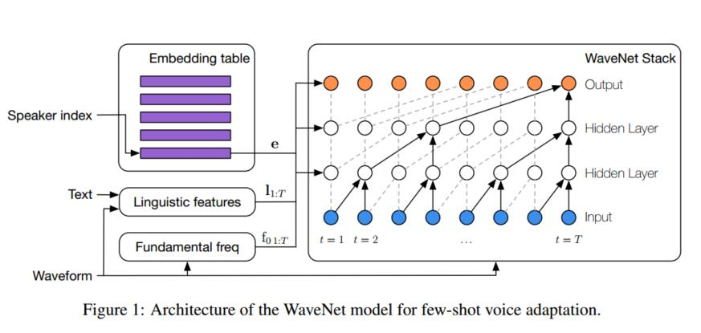
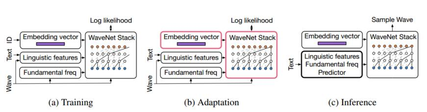
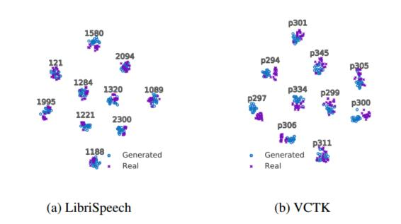
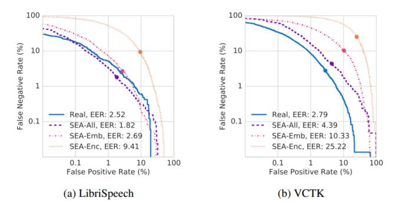
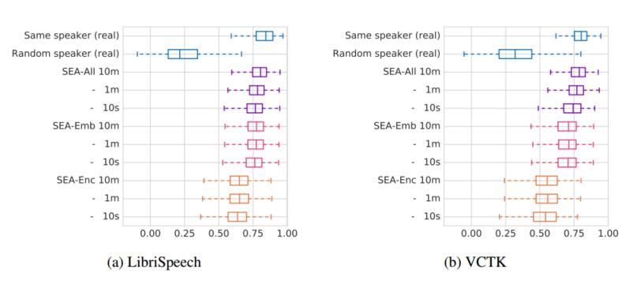
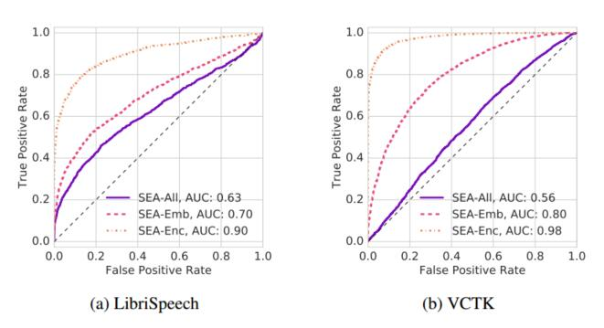

# 可自适应样本的文本语音转换（声纹克隆）
  
  
原文地址：https://arxiv.org/abs/1809.10460v3
  
Yutian Chen, Yannis Assael, Brendan Shillingford, David Budden, Scott Reed,
Heiga Zen, Quan Wang, Luis C. Cobo, Andrew Trask, Ben Laurie,
Caglar Gulcehre, Aäron van den Oord, Oriol Vinyals, Nando de Freitas
  
DeepMind & Google
yutianc@google.com
  
  
## 摘要
  
&emsp;&emsp;我们提出了一种基于元学习的自适应文本到语音(TTS)方法。在训练过程中，我们训练了使用共享条件的多说话者模型WaveNet核心和学习每个独立发言者如何嵌入到其中。训练的目的不是生成一个具有固定权值并将其部署为TTS系统的神经网络。相反，我们的目标是创建一个在部署时只需要很少数据就能快速适应新声纹特性的网络。我们介绍并比较了三种策略:(i)学习声纹的嵌入，同时保持WaveNet核心固定，(ii)使用随机梯度下降对整个架构进行微调，(iii)经过预先训练的神经网络编码器来预测新声纹嵌入。实验表明，这些方法能够成功地将多说话者神经网络应用到新的声纹上，在样本自然度和语音相似度方面都取得了最先进的结果，而这仅仅需要新说话人几分钟的音频数据。
  
## 1 介绍
  
&emsp;&emsp;使用大量数据来训练一个大型模型，然后部署该模型进行分类或回归是机器学习中一种重要且常见的方法。在语音识别(Hinton et al.， 2012)、机器翻译(Wu et al.， 2016)、图像识别(Krizhevsky et al.， 2012)等领域尤为成功;Szegedy等，2015)。在这个文本到语音(TTS)的工作中，我们对少样本的元学习感兴趣。这里的训练目标不是学习一个固定参数的分类器，而是学习一个“先验”神经网络。这种现有的TTS网络可以快速调整，使用很少的数据，在部署时为新声纹样本生成TTS系统。也就是说，我们的目的不是学习一个固定的最终模型，而是学习一个在部署时利用很少数据来快速学习新行为的模型。训练的输出不再是一个固定的模型，而是一个能够快速学习的‘元模型’。
&emsp;&emsp;生物学为这一研究方向提供了参考。有人可能会说，进化是一个缓慢的适应过程，这导致生物机器在其一生中能够迅速适应新数据。这些机器天生就有强大的优势，可以适应快速学习。
&emsp;&emsp;我们考虑一种元学习方法，模型有两种类型的参数:依赖于任务的参数和独立于任务的参数。在训练期间，我们学习了所有这些参数，但是丢弃了与任务相关的参数，以便进行部署。其目标是使用少量数据快速学习新任务的任务相关参数
&emsp;&emsp;任务相关参数在经典概率图形模型中扮演着与潜在变量相似的角色。直观地说，这些变量引入了灵活性，因此更容易学习独立于任务的参数。例如，在经典的隐马尔科夫模型中，知道潜在变量会使问题变得简单，即估计呈指数族分布的参数。在神经网络中，当数据具有明显的多样性和分类时，这种方法也有助于训练模型。我们对自适应TTS (Dutoit, 1997;泰勒,2009)。在这个模型中，说话者对应于任务。在训练过程中，我们有许多发言者，因此有任务相关的参数来捕捉发言者特定的语音风格是很有帮助的。同时，有一个大的使用共享参数的模型来捕获将文本映射到语音的通用过程也是有用的。为此，我们采用了WaveNet模型。
&emsp;&emsp;WaveNet (van den Oord et al.， 2016)是语音波形的自回归生成模型，在语音合成中已经取得了最先进的性能。该模型随后通过概率密度浓缩修正为前馈模型，用于实时语音生成(van den Oord et al.，，2017)。WaveNet的一个基本缺陷是需要为每个演讲者提供数小时的培训数据。在这篇论文中，我们描述了一种新的WaveNet训练程序，它可以帮助适应新的说话声音，可以从不超过10分钟的数据合成新的，并且具有高质量的样本。
&emsp;&emsp;我们提出了几种方式来扩WaveNet，使其能有效的自适应新样本。首先，我们提出了两种非参数自适应方法，涉及到使用给定的一个新的音频数据，然后仅仅微调声纹嵌入网络或所有的模型参数。其次，我们提出一个参数独立的文本方法，其中一个辅助网络训练预测新的声纹嵌入向量。
&emsp;&emsp;实验表明，所有提出的方法，只要提供几秒或几分钟的录音，就可以产生高保真度的话语，并且与演示演讲者的声道特征非常相似，特别是当整个模型端到端进行微调时。当微调时，首先估计声纹的嵌入，然后微调整个模型，我们在样本的自然性和语音相似的目标扬声器方面取得了最先进的结果。这些结果在不同条件下记录的语音数据集之间是可靠的，而且，我们证明生成的样本能够混淆最先进的独立于文本的语音验证系统(Wan et al.， 2018)。
&emsp;&emsp;TTS技术需要在受控环境中为每种新语音风格收集数小时的高质量录音。考虑到这种高成本，减少训练数据集的长度可能是有价值的。例如试图恢复声音受损的患者的声音。在这些情况下，长时间高质量的录音是很难达到的。
***

图1:用于少样本语音适应的WaveNet模型的体系结构。
***
## 2 WAVENET结构
  
&emsp;&emsp;WaveNet是一个自回归模型，它分解了一个波形的联合概率分布，，化为使用概率链式法则推出的条件分布的乘积:

其中为第t个时间点的样本，h和w分别为模型的条件输入和参数。为了训练一个多说话人WaveNet进行文本到语音的合成，条件输入h由说话人身份s索引的说话人嵌入向量、语言特征l和对数基频f0值组成。l对输入文本中的音素序列进行编码，f0控制生成的语音中的音高动态。给定数据集中每个话语的说话人身份s，模型表示为:

其中声纹嵌入向量(嵌入在图1中)与标准WaveNet参数一起学习。这些向量捕获单个说话者的显著语音特征，并为将WaveNet推广到本文的少样本适应设置提供了一种方便的机制。语言特征l和基频值f0都是采样频率低于波形的时间序列。因此，作为局部条件变量，它们被转置卷积网络进行上采样。在训练过程中，通过信号处理方法从训练文本对和转录本中提取l和f0，在测试过程中，通过现有模型从文本中预测这些值(Zen et al.， 2016)，详见附录A。
  
  
***

图2:sea - all架构的训练(缓慢，大量数据)、适应(快速，少量数据)和推断阶段。带有醒目粉色轮廓的组件在适应阶段进行了微调。训练的目的是产生一个先验架构。这一先验与适应过程中的少量数据相结合来拟合一个新任务。然后在最后的推理阶段部署这个经过调整的模型。
***
  
## 3 使用WAVENET的少样本适应
  
&emsp;&emsp;近年来，大量文献使用大型数据集训练模型学习输入输出映射，然后用于推理。相比之下，少量的元学习引入了一个额外的步骤，适应。在这个元学习环境中，训练的目的变成了学习的学习（即先验知识）。在适应过程中，该先验与少量数据相结合，快速学习一项新技能;在这种情况下，要适应新的说话人的说话风格。最后，我们学习到了新技能，在本文中我们称之为推理。这三个阶段——训练、适应和推理——如图2所示。
&emsp;&emsp;我们提出了两个多说话人的WaveNet扩展，用于少量样本语音适应。首先，我们介绍了一种非参数模型微调方法，它涉及到使用保留的测试数据调整声纹的嵌入或所有的模型参数。其次，为了便于比较，我们使用参数化方法，通过训练辅助网络，利用测试数据预测新声纹的嵌入向量。
  
### 3.1非参数微调小波自适应
  
&emsp;&emsp;受到少样本学习的启发，我们首先在一个大而不同的数据集上预训练一个多说话人条件WaveNet模型，如第2节所述。随后，我们对保留的自适应数据进行再训练，对模型参数进行微调。
&emsp;&emsp;训练该WaveNet模型以最大化生成音频的条件对数似然，联合优化声纹参数集和共享的WaveNet核心参数w。接下来，我们将该方法扩展到一个新的声纹样本，从他们的自适应数据中提取l和f0特征，并随机初始化一个新的嵌入向量e。然后我们对e进行优化，，与特征进行搭配，在权重w固定时模型能够产生演示波形：

&emsp;&emsp;此外，当所有的模型参数可以额外微调时(SEA-ALL):

  
  
&emsp;&emsp;当嵌入向量的数量与说话者的数量成比例时，用于实现少样本语音自适应的这两种方法都是非参数化的方法。然而，训练过程略有不同。由于SEA-EMB方法只优化了一个低维向量，因此它不太容易过度拟合，因此我们能够对模型进行再训练，使其收敛，甚至只需几秒钟的自适应数据。相比之下，SEA-ALL 拥有更多的参数，这些参数可能与适应数据过于吻合。因此，我们保留了10%的演示数据，用于计算关于保留数据的对数似然性的标准早期终止标准（standard early termination criterion on the log-likelihood of the hold-out data……）。我们还使用SEA-EMB方法的最优值对e进行了初始化，我们发现这种初始化即使使用几秒钟的自适应数据也能显著提高泛化性能。
  
### 3.2采用嵌入编码器进行参数化的少样本自适应
  
&emsp;&emsp;与非参数方法不同，参数方法为每个样本拟合不同的嵌入向量，可以训练一个辅助编码器网络，在给定其演示数据的情况下预测新样本的嵌入向量。具体来说,我们定义:

  
  
&emsp;&emsp;其中，对于每个训练示例，除了常规条件输入外，我们还包括从此说话者随机选择的演示话语。完整的WaveNet模型和编码器网络e(·)是从头开始一起训练的。请读者参阅附录了解更多的体系结构细节。这种方法(SEA-ENC)的优点是，只需输入波形，就可以在独立于转录的环境中进行训练，并且在适应时所需的计算量可以忽略不计。然而，由于网络容量有限，声纹编码器在拟合嵌入时也会引入偏差。例如，Li et al.(2017)展示了一个典型的场景，即说话人身份信息可以非常快速地从音频信号中通过深度模型提取出来。虽然如此，与基于统计方法的方法相比，该模型无法有效利用额外的训练。
  
### 3.3 去除与身份相关的信息
  
&emsp;&emsp;作为输入的语言特征和基本频率包含特定于单个说话人的信息。例如，基频序列中的平均音高高度个人化。相反，我们希望这些特性尽可能独立于说话者，这样身份就可以通过嵌入说话者的全局条件作用来建模。为了达到这个目的，我们在训练过程中对每个说话人的基频值进行归一化，使其均值和单位方差分别为零。表示为：。如前所述，在测试时，我们使用现有模型(Zen et al.， 2016)来预测
  
## 4 相关的工作
  
  
&emsp;&emsp;通过小样本学习来建立模型，在机器学习中，最重要的开放挑战之一是如何使用少量样本进行快速学习。最近的研究试图利用深度神经网络来解决这一问题，他们在机器视觉分类 (Santoro et al.， 2016;Shyam et al.， 2017)，翻译(Vinyals et al.， 2016)和语音识别(Abdel-Hamid and Jiang, 2013) 等任务上也取得了很好的效果。在强化学习中，也可以利用少样本学习，例如从录制的人类玩家所做的单个动作序列(Pohlen et al.， 2018)或在线视频(Aytar et al.， 2018)中模仿他们来学习雅达利游戏的策略。
&emsp;&emsp;元学习（Meta-learning）提供了一个很好的框架来进行小样本学习。这种方法中，学习过程中昂贵的代价导致机器能够从很少的样本中快速学习。元学习有着悠久的历史(Harlow, 1949;特伦和普拉特，2012)，最近的研究，包括学习优化过程所做的努力，都被发现可以自然的延伸到小样本学习的设置中去。另一种方法是黑盒模型元学习(MAML) (Finn et al.， 2017a)，它的不同之处是使用固定的优化器和学习一组基本参数，这些参数在梯度下降中可以以很少的次数很快的速度达到较低的loss。这种方法为机器人技术带来了希望。
&emsp;&emsp;在生成式模型中，已经从多种角度使用了少样本学习，包括匹配网络(Bartunov and Vetrov, 2017)和记忆寻址的变量推理(Bornschein et al.， 2017)。Rezende et al.(2016)开发了一个序列生成模型，扩展了深度注意循环生成(DRAW)模型(Gregor et al.， 2015)和Reed et al.。(2018)对PixelCNN (Van Oord et al.， 2016)用注意力机制进行的扩展，从而实现少样本的自回归密度建模。Veness等(2017)提出了一种门控线性模型，能够从有限数据集的单一遍历中对复杂密度进行建模。
&emsp;&emsp;早期尝试的少样本适应涉及到了Reed et al. (2018)的注意力模型和MAML(Finn et al., 2017a)，但是我们发现这两种策略都未能在我们的初步实验中学习到丰富的隐含声纹信息。
&emsp;&emsp;人们对开发基于神经网络的TTS（text to sound 语音合成）模型越来越感兴趣，这种模型可以端到端地训练，而不需要人工特征提取以及模型搭建。在本研究中，我们着重于扩展自回归WaveNet模型(van den Oord等，2016;)的小样本学习设置，以适应训练样本中没有出现的人类声音。其他最近的神经网络TTS模型包括Tacotron 2 (SkerryRyan et al.， 2018)(在(Wang et al.， 2017)的基础上)，它使用WaveNet作为声码器来转换由一个注意力模型序列到序列模型生成的梅尔频谱。DeepVoice 2(Gibiansky et al .,2017)(建筑(Arık et al .,2017))引入了一个多人语音 Tacotron变种,学习每个人声纹的低维嵌入，在DeepVoice 3中，它被进一步扩展(Ping et al.， 2018)到了2400个多人演讲场景。与WaveNet和DeepVoice不同, Char2Wav(Sotelo et al.， 2017)和VoiceLoop (Taigman et al.， 2018)的模型产生了World Vocoder特性(Morise et al.， 2016)而不是生成原始音频信号
&emsp;&emsp;尽管这些系统对于训练集中已有的声纹可以产生高质量的样本，对于一个仅仅只有数秒的新音频来建模生成还是一个挑战。现阶段已经有一些团队在研究这种小样本学习问题。VoiceLoop模型引入了一种新的基于记忆的架构，该架构由Nachmani等人(2018)扩展到小样本的声纹匹配上，具体方法是通过引入辅助拟合网络来预测新声纹的嵌入。Jia等(2018)从Wan等(2018)的预训练声纹识别模型中提取输出的中间向量，用其作为条件对Tacotron模型进行了一次声纹匹配的扩展。与我们的工作最相似的方法是Arik等人提出的。(2018) DeepVoice 3模型。他们考虑了用编码网络预测音频的嵌入向量和基于少量自适应数据拟合这个嵌入向量，但该方法适用于固定声码器的梅尔谱预测模型。
  
## 5 评价
  
  
&emsp;&emsp;在这一节中，我们评估了SEA-ALL、SEA-EMB和SEA-ENC产生的样品的质量。我们首先使用标准平均意见评分(MOS)程序来测量生成的话语的自然度。然后，我们使用主观MOS检验和客观上使用声纹验证系统来评估生成的样本和真实样本的相似性(Wan et al.， 2018)。
  
### 5.1 实验准备
  
  
&emsp;&emsp;我们使用相同的数据集，结合高质量LibriSpeech audiobook语料库(Panayotov et al.， 2015)和专有语音语料库，为我们的三种方法中的每一种训练一个WaveNet模型。LibriSpeech数据集中训练语音集含有2302个音频（大约有500小时），采样频率为16khz。专有语料库由10名美国英语使用者和大约300个小时的发言组成，我们将录音频率降采样至16khz以匹配LibriSpeech语料库。多人WaveNet模型与van den Oord等人(2016)的架构相同，不同之处是我们使用了一个200维的声纹嵌入向量空间来表示声音中含有的丰富多样性。
<table border="0" cellpadding="0" cellspacing="0" width="752" style="width: 564pt;">
  
 <colgroup><col width="240">
 <col width="140" span="2" style="mso-width-source:userset;mso-width-alt:4977;
 width:105pt">
 <col width="113">
 <col width="119">
 </colgroup><tbody><tr height="18">
  <td height="18" class="xl63" width="240">数据集&nbsp;</td>
  <td colspan="2" class="xl64" width="280" style="border-right-width: 0.5pt; border-right-color: black; border-left: none; width: 210pt;">LibriSpeech&nbsp;</td>
  <td colspan="2" class="xl64" width="232" style="border-right-width: 0.5pt; border-right-color: black; border-left: none; width: 174pt;">VCTK</td>
 </tr>
 <tr height="18">
  <td height="18" class="xl63" width="240" style="height:13.8pt;border-top:none;
  width:180pt">真实训练集&nbsp;</td>
  <td colspan="2" class="xl64" width="280" style="border-right-width: 0.5pt; border-right-color: black; border-left: none; width: 210pt;">4.38
  ± 0.04&nbsp;</td>
  <td colspan="2" class="xl64" width="232" style="border-right-width: 0.5pt; border-right-color: black; border-left: none; width: 174pt;">4.45
  ± 0.04</td>
 </tr>
 <tr height="18">
  <td height="18" class="xl63" width="240" style="height:13.8pt;border-top:none;
  width:180pt">van den Oord et al. (2016)&nbsp;</td>
  <td colspan="4" class="xl66" width="512" style="border-right-width: 0.5pt; border-right-color: black; border-left: none; width: 384pt;">4.21
  ± 0.081</td>
 </tr>
 <tr height="123">
  <td height="123" class="xl63" width="240" style="height:92.4pt;border-top:none;
  width:180pt">Nachmani et al. (2018)  
    Arik et al. (2018) 
    adapt embedding  
    adapt whole-model  
    encoding + fine-tuning  
    Jia et al. (2018) 
    trained on LibriSpeech&nbsp;</td>
  <td colspan="2" class="xl64" width="280" style="border-right-width: 0.5pt; border-right-color: black; border-left: none; width: 210pt;">2.53
  ± 1.11  
    -  
    -  
    -  
    <strong>4.12 ± 0.05&nbsp;<strong></td>
  <td colspan="2" class="xl64" width="232" style="border-right-width: 0.5pt; border-right-color: black; border-left: none; width: 174pt;">3.66
  ± 0.84 
    2.67 ± 0.10 
    3.16 ± 0.09 
    2.99 ± 0.12 
    <strong>4.01 ± 0.06</strong></td>
 </tr>
 <tr height="18">
  <td height="18" class="xl63" width="240" style="height:13.8pt;border-top:none;
  width:180pt">目标声纹样本时间&nbsp;</td>
  <td class="xl63" width="140">10s&nbsp;</td>
  <td class="xl63" width="140">&lt;5m&nbsp;</td>
  <td class="xl63" width="113">10s&nbsp;</td>
  <td class="xl63" width="119">&lt;10m</td>
 </tr>
 <tr height="53">
  <td height="53" class="xl63" width="240" style="height:39.6pt;border-top:none;
  width:180pt">SEA-ALL (我们的)
   
    SEA-EMB (我们的)  
    SEA-ENC (我们的)&nbsp;</td>
  <td class="xl63" width="140">3.94 ± 0.08
   
    3.86 ± 0.07  
    3.61 ± 0.06&nbsp;</td>
  <td class="xl63" width="140"><strong>4.13 ± 0.06</strong>
   
    3.95 ± 0.07  
    3.56 ± 0.06&nbsp;</td>
  <td class="xl63" width="113"><strong>3.92 ± 0.07</strong>
   
    3.81 ± 0.07  
    3.65 ± 0.06&nbsp;</td>
  <td class="xl63" width="119"><strong>3.92 ± 0.07</strong> 
    3.82 ± 0.07 
    3.58 ± 0.06</td>
 </tr>
  
</tbody></table>
表格1：在LibriSpeech和VCTK提供的训练数据集上，使用5级MOS评分(越高越好)和95%置信区间的生成的目标语音的自然度。粗体的数字是在没有统计学上的显著差异时，每个数据集上最好的少样本学习的结果。van den Oord et al. (2016)采用24小时高质量的数据进行培训，Nachmani等(2018)使用每个新声纹的所有样本，Arik等(2018)使用10个样本，Jia等(2018)只使用了5秒的新样本音频。
  
  
  
&emsp;&emsp;我们使用两个保留的数据集来评估我们的小样本学习模型的性能。首先，LibriSpeech测试语料库由39个说话者组成，平均每个说话者大约52个话语和5分钟的音频。对于每个测试说话者，我们随机地将他们的演示话语分为适应WaveNet模型的适应集和评估测试集。3.1节中用于提前终止的语音集合是从适应集合中选择的。接着，我们考虑CSTR VCTK语料库(Veaux et al.， 2017)的一个子集，该语料库由21名美语使用者组成，每个说话者大约有368次话语和12分钟的音频。我们也将每个说话人10个话语的自适应/测试拆分开来进行测试。注意，在训练时没有向模型提供来自VCTK的数据。由于我们的底层WaveNet模型主要基于LibriSpeech(在比VCTK更嘈杂的条件下记录的)的数据进行训练，有人可能猜测基于VCTK数据集上生成的样本包含某种人工特征，会使得生成的样本更容易与真实的话语区分开来。然而，我们使用VCTK进行的评估表明，我们的模型可以有效地一般化，并且这些人工特征灭有被检测到。我们的演示网页提供了合成语音。
  
&emsp;&emsp;值得一提的是，SEA-ENC不需要任何适应时间。但是对于SEA-EMB来说，它需要5∼10 k次优化步骤来拟合嵌入向量,SEA-ALL则需要使用提前结束（early stopping），这需要额外的100∼200步骤来调整整个模型。
  
  
### 5.2生成音频的自然度(MOS)
  
&emsp;&emsp;我们通过进行MOS测试来衡量生成的音频样本的质量，在测试中，受试者被要求在李克特量表（Likert Scale）(1:很差，2:差，3:一般，4:好，5:优秀)做出选择。此外，我们还与与此工作并行开发的其他已发布的少量TTS系统进行了比较。然而，其他文献中使用了不同的训练数据组合和评估分割，使得比较工作很困难。给出的结果来自于我们最近的实验结构。
&emsp;&emsp;表1给出了自适应模型与真实语音的比较。考虑了两种不同的自适应数据集大小;LibriSpeech中T = 10秒,T≤5分钟(VCTK中则是T≤10分钟)。对于16 kHz数据的参考，WaveNet在一个24小时制作的高质量语音数据集(van den Oord et al.， 2016)上的训练得到了4.21分，而对于LibriSpeech，我们最好的少样本模型在一个预先训练的多人语音模型下，仅使用5分钟的新目标音频就获得了4.13分的MOS分数。我们注意到，这两个微调模型都为LibriSpeech和VCTK测试集生成了总体“良好”的样本，SEA-ALL在所有情况下都优于SEA-EMB。SEA-ALL在这两个数据集上都与最先进的性能相当。10秒之上的额外的数据音频有助于模型在LibriSpeech数据集上的表现，VCTK则没有这一特性，我们最好的模型和真实的话语之间的差距也在VCTK上更大，这可能是不同的录制条件的原因。
<table>
   <tr><td>数据集</td><td colspan=2>LibriSpeech</td><td colspan=2> VCTK</td></tr>
   <tr><td>真实数据</td><td colspan=2>4.30 ± 0.08<td colspan=2>4.59 ± 0.06 </td></tr>
   <tr><td>Jia等(2018)对LibriSpeech进行的训练</td><td colspan=2>3.03 ± 0.09</td><td colspan=2>2.77 ± 0.08 </td></tr>
   <tr><td>目标声纹样本时间</td><td>10s</td><td><5m</td><td>10s</td><td><10m</td></tr>
   <tr><td>SEA-ALL (我们的)</td><td>3.41 ± 0.10 </td><td>3.75 ± 0.09 </td><td>3.51 ± 0.10 </td><td>3.97 ± 0.09</td></tr>
   <tr><td>SEA-EMB (我们的)</td><td><strong>3.42 ± 0.10 </strong></td><td>3.56 ± 0.10 </td><td>3.07 ± 0.10 </td><td>3.18 ± 0.10</td></tr>
   <tr><td>SEA-ENC (我们的)</td><td>2.47 ± 0.09</td><td>2.59 ± 0.09 </td><td>2.07 ± 0.08 </td><td>2.19 ± 0.09</td></tr>
</table>
表格2：在LibriSpeech和VCTK提供的测试数据集上，使用5级MOS评分(越高越好)和95%置信区间生成的语音相似度
  
  
### 5.3语音相似度(MOS)
  
&emsp;&emsp;除了自然之外，我们还测量生成的声音和真实声音的相似性。相似度是声纹克隆问题的主要评价指标。我们首先按照Jia et al.(2018)的实验方法，通过MOS测试进行主观评价，然后接着使用语音识别系统进行客观评价。
&emsp;&emsp;在这个测试的每一次试验中，被试者都要面对一对音频，由一个真实的和另一个生成的或由同一说话人的真实语音组成，然后他会被要求对语音识别的相似性进行五分制评分(1:完全不相似，2:略微相似，3:中度相似，4:非常相似，5:非常相似)。
&emsp;&emsp;表2显示了两个数据集上的两种样本数据时间设置下真实话语与生成结果的MOS得分。同样，SEA-ALL模型的性能优于其他两个模型，并且随着训练数据量的增加，SEA-EMB的改进程度也有所提高。特别是VCTK数据集上的学习语音平均得分为3.97分，说明了在不同数据集上的泛化性能。作为一个粗略的对比，由于不同的训练样本设置，Jia等(2018)的art system在LibriSpeech培训中得分为3.03分，VCTK在LibriSpeech培训中得分为2.77分。他们的模型基于d-vector计算嵌入，类似于我们的SEA-ENC方法，在少样本环境下，它的表现很有竞争力，但它的表现被5秒的适应数据所饱和，如3.2节所述。我们注意到SEA-ALL和真实样本之间的相似性评分差距，这表明，尽管生成的样本听起来与目标说话人很相似，但人类仍然可以分辨出不同于真实话语的声音。
  
### 5.4 语音相似度(语音识别系统)
  
&emsp;&emsp;我们还应用了最先进的文本独立语音验证系统(TI-SV)(Wan等，)客观评估生成的样本是否保留人类语音的声学特性。我们计算了TI-SV 的生成样本和真实的声音的d-vector嵌入向量。在图3中,我们可视化了SEA-ALL模型（LibriSpeech数据集，T ≤ 5 分钟）与（VCTK，T ≤ 10分钟）的d-vectors的二维投影。两个数据集上都有清晰的集群，集群间的距离非常大，集群内的分离非常低。这表明(1)正确识别与给定生成的话语相关的说话人很容易，(2)区分真实和合成样本很困难。
&emsp;&emsp;(Jia et al.， 2018)中也给出了类似的数据，但是生成的样本与真实样本并没有重叠。这表明，在相同的验证系统下，本文方法生成的语音与真实语音更加难以区分。在下面的小节中，我们将进一步分析这些结果。
***

图3:t-SNE可视化映射,真实语音与SEA-ALL模型生成的语音,LibriSpeech (T≤5分钟)和VCTK (T≤10分钟)评估数据集。
***

图4:用于语音验证系统的检测误差权衡(DET)曲线百分比，使用TI-SV语音验证系统(Wan et al.， 2018)。语音是使用T≤5和T≤10分钟分别在LibriSpeech和VCTK的数据集上生成的。EER用一个点标记出来了。
***
#### 5.4.1 辨别不同的人声
  
&emsp;&emsp;我们首先量化生成的话语是否属于正确的说话人。按照语音验证的一般做法(Wan et al.， 2018)，我们选取测试说话人真实话语的保留测试集作为登记集，计算每个说话人ci的d向量质心。然后我们使用测试生成语音的自适应集作为验证集。对于每个验证语音，我们计算它的d向量v和随机选择的质心ci之间的余弦相似度。如果相似度超过了给定的阈值，则从语音i中接受该次验证。我们使用相同的登记集重复实验，并在不同的数据大小设置下用每种自适应方法生成的样本替换验证集。
***
<table border="0" cellpadding="0" cellspacing="0" width="752" style="width: 564pt;">
  
 <colgroup><col width="240">
 <col width="140" span="2" style="mso-width-source:userset;mso-width-alt:4977;
 width:105pt">
 <col width="113">
 <col width="119">
 </colgroup><tbody><tr height="18">
  <td height="18" class="xl70" width="240">数据集</td>
  <td colspan="2" class="xl66" width="280" style="border-right-width: 0.5pt; border-right-color: black; border-left: none; width: 210pt;">LibriSpeech&nbsp;</td>
  <td colspan="2" class="xl66" width="232" style="border-right-width: 0.5pt; border-right-color: black; border-left: none; width: 174pt;">VCTK</td>
 </tr>
 <tr height="18">
  <td height="18" class="xl70" width="240" style="height:13.8pt;border-top:none;
  width:180pt">真实数据</td>
  <td colspan="2" class="xl68" align="right" width="280" style="border-right-width: 0.5pt; border-right-color: black; border-left: none; width: 210pt;">2.47</td>
  <td colspan="2" class="xl68" align="right" width="232" style="border-right-width: 0.5pt; border-right-color: black; border-left: none; width: 174pt;">2.79</td>
 </tr>
 <tr height="18">
  <td height="18" class="xl71" width="240" style="height:13.8pt;border-top:none;
  width:180pt">测试样本时间</td>
  <td class="xl64" width="140">10s&nbsp;</td>
  <td class="xl64" width="140">1m&nbsp;</td>
  <td class="xl64" width="113">&lt;5m&nbsp;</td>
  <td class="xl64" width="119">10s&nbsp;</td>
 </tr>
 <tr height="53">
  <td height="53" class="xl63" width="240" style="height:39.6pt;border-top:none;
  width:180pt">SEA-ALL (我们的)  
    SEA-EMB (我们的)  
    SEA-ENC (我们的)&nbsp;</td>
  <td class="xl65" width="140">3.17
   
    3.26  
    10.73&nbsp;</td>
  <td class="xl65" width="140">2.47
   
    2.92  
    9.77&nbsp;</td>
  <td class="xl65" width="113">1.85
   
    2.74  
    9.42&nbsp;</td>
  <td class="xl65" width="119">7.34
   
    10.18  
    27.20&nbsp;</td>
 </tr>
  
</tbody></table>
  
  
表3:用于评价语音相似度的真实和少样本学习模型生成的语音样本的等错误率(EER)。考虑了不同的自适应数据集大小。
***

图5:真实的和生成的语音到真实登记集的余弦相似度
***
&emsp;&emsp;在我们的设置中，我们将登记集与语音验证系统结合在一起(Wan等人，），来研究来自真实的语音或TTS系统生成的语音的不同验证集的性能。表3列出了带有真实验证语句和生成验证语句的验证模型的等错误率(EER)，图4给出了检测误差权衡(DET)曲线，便于更全面的检查。图4只显示了小样本模型在最大数据大小下训练(T≤5分钟VCTK LibriSpeech和≤10分钟)的结果。其他数据大小的结果见附录C。
&emsp;&emsp;我们发现SEA-ALL优于其他两种方法，并且随着演示数据的大小，错误率明显降低。我们的SEA-EMB模型优于SEA-ENC模型。此外，在这两种模型中，更多的演示数据所带来的好处都不如SEA-ALL那么显著。
&emsp;&emsp;值得注意的是，SEA-ALL的EER甚至比具有足够的真实语音数据的LibriSpeech数据集上的更低。一种可能的解释是，生成的样本可能更接近说话人语音的嵌入向量的质心，而不是在不同话语之间差异更大的真实语音。此外，考虑不同生成模型对应的整个DET曲线与图4实际数据的DET曲线之间的相似性，比只考虑单个EER点估计(图4中的点)更有意义。
  
#### 5.4.2从生成的话语中识别真实语音
  

&emsp;&emsp;在本节中，我们将比较生成的样本和被克隆的真实话语。图5显示了测试语音登记集的嵌入向量质心与(1)来自同一说话人的真实话语，(2)来自不同说话人的真实话语，(3)基于小样本学习模型的生成语音，它们之间余弦相似度的箱线图。与上一小节的观测结果一致，SEA-ALL模型表现最佳。
&emsp;&emsp;我们进一步考虑具有对抗性的语音验证方案。与前面的标准说话人验证设置不同，我们现在使用来自同一说话人的真实话语或来自适用于同一说话人的小样本模型的合成样本来选择验证话语。在这种设置下，语音验证系统受到合成样本的挑战，并充当真实话语和生成话语的分类器。此设置的ROC曲线如图6所示，模型使用的是最大数据大小设置。可以在附录D其中找到其他数据大小设置。如果生成的样本与真实语音无法区分，则ROC曲线接近对角线(即验证系统无法区分真实语音和生成语音)。重要的是，SEA-ALL混淆了验证系统，尤其是对于VCTK数据集，其中ROC曲线几乎与对角线对齐，AUC为0:56。
## 6 结论
  
  
&emsp;&emsp;本文研究了样本有效自适应TTS的三种元学习变体。自适应方法对整个模型进行微调，首先优化扬声器嵌入向量，即使只有10秒的新音频样本，这几种模型仍有着令人称赞的表现。当使用几分钟的数据进行调整时，我们的模型在样本自然性方面有着最先进的性能。此外，它在匹配新说话者的声音方面比最近的其他作品表现得更好。我们还证明，当使用文本独立的语音验证系统测量时，生成的样本与来自同一说话者的真实话语的语音相似度达到了极高的水平。
&emsp;&emsp;我们的论文考虑了在受控环境下收集的干净、高质量的训练数据对新声音的适应。有噪声数据语音的小样本学习超出了本文的研究范围，但这仍然是一个具有挑战性的开放研究问题。
&emsp;&emsp;但是，少样本学习这个模型也带来了问题，它增加了文本到语音技术的有益和有害应用的潜力，例如合成媒体的创建。虽然这个模型在某些方面有着需求(包括高质量的训练样本，包括在受控环境中收集的数据和从说话人获取同样高质量的数据,如5.1节所述)对于滥用有着壁垒,所以必须进行更多的研究,以缓解和语音合成技术的滥用。
  